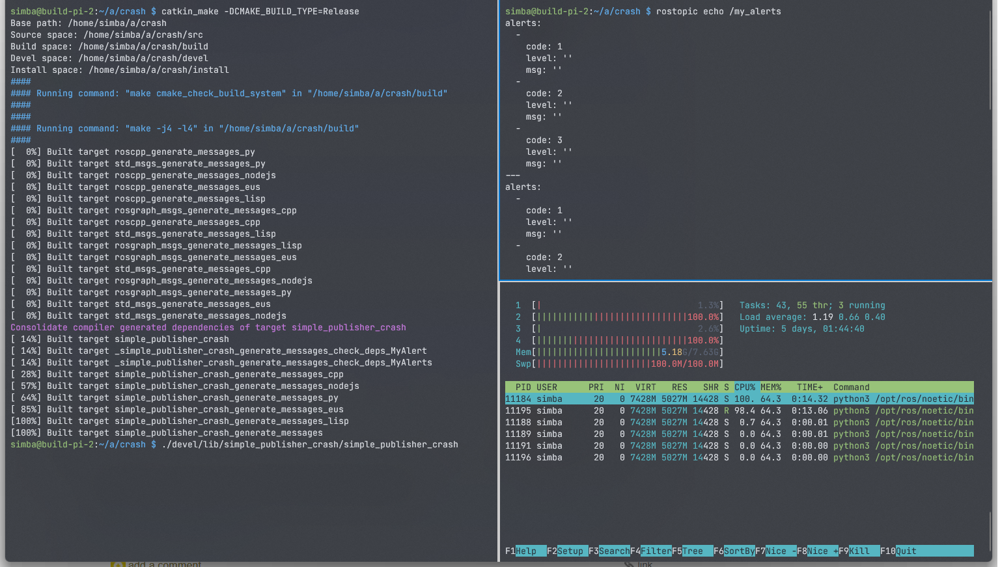

# ROS crash on Raspberry Pi 4B with a very simple program <!-- omit in toc -->

- [Bug Description](#bug-description)
- [Screenshot](#screenshot)
- [Program to Reproduct the Bug](#program-to-reproduct-the-bug)
- [Progress](#progress)

:warning: **This has be confirmed as a GCC bug on ARM64.**: https://github.com/ros/ros_comm/issues/2197

## Bug Description

With ROS noetic on Raspberry PI model 4B(64bit ARM), we frequently encounter ROS message related problems.

Sometimes it says:

```
a message of over a gigabyte was predicted in tcpros. that seems highly unlikely,
so I'll assume protocol synchronization is lost
```

Sometimes the memory usage soars and cause program crash.

I created this simple program, and successfully reproduced it. When run `rostopic echo /my_alerts`, it will eat up all memory.

**NOTE: It only happens with GCC release version**:

- `catkin_make -DCMAKE_BUILD_TYPE=Release` Crash
- `catkin_make` OK
- `catkin_make -DCMAKE_BUILD_TYPE=Release -DCMAKE_C_COMPILER=/usr/bin/clang-9 -DCMAKE_CXX_COMPILER=/usr/bin/clang++-9` OK

The system image is downloaded from https://downloads.raspberrypi.org/raspios_lite_arm64/images/

## Screenshot



## Program to Reproduct the Bug

```
#include <ros/ros.h>
#include "ros/console.h"
#include "simple_publisher_crash/MyAlerts.h"

int main(int argc, char** argv)
{
    ros::init(argc, argv, "simple_publisher_crash");

    ros::NodeHandle nh("~");

    ros::Publisher alertsPub = nh.advertise<simple_publisher_crash::MyAlerts>("/my_alerts", 1, true);

    ros::Rate loop(1);
    while (ros::ok())
    {
        ros::spinOnce();

        simple_publisher_crash::MyAlerts msg;
        simple_publisher_crash::MyAlert alert;
        alert.code = 1;
        alert.level = "";
        alert.msg = "";
        msg.alerts.push_back(alert);
        alert.code = 2;
        msg.alerts.push_back(alert);
        alert.code = 3;
        msg.alerts.push_back(alert);

        alertsPub.publish(msg);

        loop.sleep();
    }

    return 0;
}
```

## Progress

- 2021-10-29 Modifying the structure of AlertMsg.msg workarounds the problem miraculously.

  ```
  int32 code
  int32 level # modify this field from string to int32
  string msg
  ```
